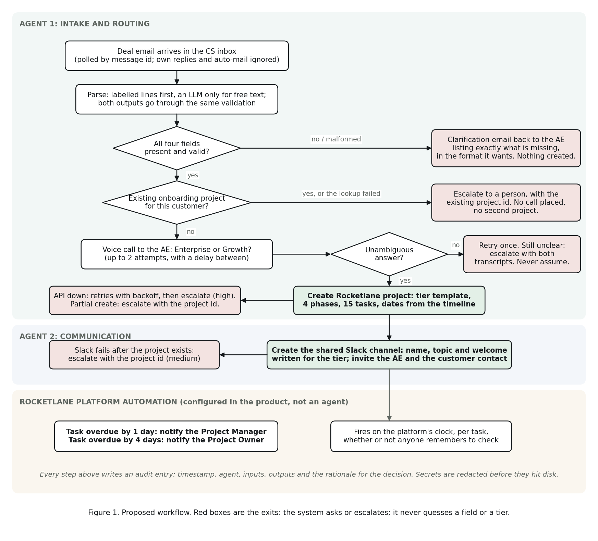

# NovaCRM Customer Onboarding Automation

## Part 1: Requirements and Workflow Analysis

Prepared by Priyesh Verma for the Rocketlane Forward Deployed Engineer assignment.

---

## 1. What Priya told us, and what it actually means

I read the discovery notes twice: once for the process, and once for the places where her wording gives away where it breaks. The second read is where the design came from.

| What she described | What it means for the design |
|---|---|
| The trigger is an AE email to a shared CS inbox, carrying the customer name and an opportunity link | The trigger is an email, and its content is whatever the AE typed. The system has to read unstructured text and cannot assume a form. |
| A project is created by hand from a standard template of roughly 15 tasks across 4 phases | The plan is stable and known. It should be encoded once and applied, not rebuilt by hand or by a model each time. |
| A shared customer Slack channel is opened and a kickoff call scheduled, both by hand | Two more manual steps that are pure function of the same inputs. |
| A 3-day block is supposed to escalate, and she volunteered that in practice it often does not | Escalation must not depend on a person remembering. It belongs in the project tool as an automation, not in the agent. |
| Enterprise and Growth have different plans and CSM models, and the templates get mixed up | The plan tier is the single most consequential input, and the email does not carry it. Getting it wrong creates the wrong 30- or 14-day plan and the wrong CSM model. So it gets confirmed by a person, out loud, before anything is created. |
| Migration tasks have been marked done without the data actually being verified | "Done" and "verified" have been the same checkbox. They need to be two tasks, and the second one has to belong to the customer. |

## 2. Current workflow, as it runs today

1. Deal closes. AE emails the CS inbox: customer name, Salesforce link, sometimes a contact.
2. A CS team member reads the email, works out (or guesses) the plan tier, and creates an Asana project from the matching template. Fifteen tasks, four phases: Kickoff, Data Migration, Configuration, Go-Live.
3. Someone creates a shared Slack channel with the customer and schedules kickoff.
4. Work proceeds. Tasks are ticked in Asana. Blocked tasks are supposed to be escalated after three days; in practice they are not.
5. At the end, a handoff summary is written and the customer moves to support.

Where it fails, in Priya's own words: tier mix-ups, escalations that never happen, and migration marked complete without verification.

## 3. Proposed agentic workflow

Two agents and one platform automation. The split is deliberate: agents handle the parts that need judgement over messy input; the platform handles the part that needs to fire reliably every day without anyone watching.

### Agent 1: Intake and Routing

Watches the CS inbox. For each new deal email:

1. **Parse.** A deterministic parser reads labelled lines first (`Customer:`, `Contact email:`, `AE:`, `Opportunity:`). If the email is free text, an LLM extracts the same four fields. Both paths feed the same validation, so the model cannot pass a guessed value through.
2. **Validate, or ask.** All four fields are required. If any are missing or malformed, the agent replies to the AE listing exactly what it needs, in the format it wants, and stops. Nothing is created.
3. **Check for an existing project.** If Rocketlane already has an onboarding project for this customer, the agent does not create a second one. It escalates to a person, who decides whether it is a duplicate or a genuine second engagement.
4. **Confirm the tier by voice.** The agent places a real phone call to the AE and asks one question: Enterprise or Growth. It accepts only an unambiguous answer. No answer, a voicemail, "let me check", or anything else counts as unclear. It retries once, then escalates. It never assumes.
5. **Create the Rocketlane project** from the confirmed tier: 30 days with a dedicated CSM, or 14 days with a pooled CSM. Four phases, fifteen tasks, dates derived from the timeline, and the two tasks only the customer can do assigned to the customer contact.

### Agent 2: Communication

Runs only after Agent 1 has a confirmed tier and a created project. Creates the shared Slack channel, sets a topic that names the customer, the plan, the timeline and the Rocketlane project, and posts a welcome message written for that tier. The Enterprise welcome introduces a dedicated CSM; the Growth welcome sets the expectation of a pooled team. Both tell the customer up front that they will be asked to verify migrated data before go-live.

### Rocketlane automation: overdue escalation

Configured inside Rocketlane, not in code. Trigger: task becomes overdue. Two rules: overdue by one day notifies the Project Manager; overdue by four days notifies the Project Owner. It fires on the platform's clock whether or not anyone remembers, which is the point.

## 4. Guardrails

- **No guessing on input.** Missing or malformed fields produce a question to the AE, never a default. When the model is used for a free-text email, every value it returns must occur verbatim in the email; a well-formed address or link the email never contained is discarded as invented and logged as such.
- **No guessing on tier.** Only a clear "Enterprise" or "Growth" from the AE's voice call is accepted. Unclear is a first-class outcome that leads to retry and then escalation.
- **No duplicate projects.** Existence is checked before creation. If the check itself cannot complete because Rocketlane is unreachable, that is also treated as "cannot proceed", because the agent cannot prove there is no existing project.
- **Retry, then hand over.** Rocketlane API failures retry with backoff, then park the case in a durable escalation queue and notify a person. Voice failures retry once, then escalate.
- **Order of operations.** Nothing external is created until every check has passed. The Slack channel is created only after the project exists, so there is never a channel pointing at nothing. Project creation is never blindly retried: if the response to the create call is lost, the agent looks the project up before it would ever send a second create.
- **No silent mocks.** A provider that is named but has no credentials refuses to start rather than falling back to a mock, and the live run refuses to begin while the inbox, the voice call or Rocketlane is still mocked. A mock that answers "Enterprise" without ringing anyone is the one failure the brief forbids, so it cannot happen by misconfiguration.
- **One call per email, even across a crash.** The message is flagged as processed and an audit entry written before the first dial, so an interrupted run cannot ring the AE again on the next poll.
- **Verification is its own task, owned by the customer.** "Customer verifies migrated data" is a separate task assigned to the customer contact, and the description says go-live is blocked on it.
- **Everything is logged.** Every agent action writes a timestamped audit entry with inputs, outputs and the rationale for the decision. Credentials are redacted before they hit disk.

## 5. Assumptions

1. Deal emails arrive in one Gmail inbox and can be recognised by a subject pattern ("Closed Won"). If NovaCRM's AEs use a different convention, it is one config value.
2. AEs' phone numbers are available from a directory (here, a config map). In production this would come from the HRIS or Salesforce user record.
3. The 15-task, 4-phase plan is the same for both tiers; only the timeline and the CSM model differ. If the tiers actually have different task lists, the template file changes and nothing else does.
4. Rocketlane templates can be configured with IDs; when they are not, the agent builds the plan explicitly from the encoded template. I built both paths because I could not find a templates endpoint in the public API reference, so a template ID has to be read from the Rocketlane UI and set in configuration.
5. The Slack workspace allows a bot to create channels, post, and invite by email. "Shared with the customer" is implemented as: the AE is invited by email, the customer contact is invited by email when they exist in the workspace, and otherwise the channel is the one NovaCRM shares out via Slack Connect. The mock records invites so the tests can check who was asked in.
6. One onboarding project per customer at a time. A second closed deal for an existing customer is a human decision.
7. "Project Manager" and "Project Owner" map to Rocketlane's project roles for the escalation automation.

## 6. What is real and what is mocked in this submission

Real: Gmail inbox monitoring, the voice call to the AE (Bland AI, with a Vapi adapter also included), Rocketlane project, phase and task creation over the public API, and the Rocketlane overdue automation.

Mocked by default, real if a token is supplied: Slack. The mock records channel, topic and message so the personalisation is visible in the demo and testable. `slack_test.py` exercises the real path end to end against a throwaway channel it archives afterwards, so the bot token and its scopes can be proven without running an onboarding.

Each integration also has a check that runs before anything real happens: `preflight.py` tests every credential and, with `--dry-run`, creates and deletes a throwaway Rocketlane project so the create path is proven before a phone call depends on it. `call_test.py` places one call in isolation and reports which of the tier-reading layers answered.

### What the first real calls changed

Everything above was designed before a phone rang. Three live calls on 19 September changed one part of it, and the change is worth recording because it is the kind of thing only a real call finds.

The voice provider's call record has no single field naming the tier it decided. It has a `dispositions` list that stays empty unless its tag model ran, and the first version of this adapter read a field that does not exist. The result was the worst shape a failure can take: every call returned "unclear" while looking entirely healthy, with a completed status and a full transcript. A check written before that call, comparing the response against the fields the adapter relies on, is what surfaced it.

The second finding was the opposite error. On a call a person answered and completed, the provider reported `answered_by: "unknown"`, and the adapter treated that as no answer and discarded a confirmation the AE had actually given. Refusing a fact you were told is as much a failure as inventing one.

So the tier is now established in two steps, both tested against transcripts of those real calls. First, did a person speak at all? That is judged from the transcript rather than the provider's own classification, with recorded greetings recognised and excluded, because a voicemail box and a handset screening service both produce speech that is not the AE. Second, what did they say? Three independent readings are tried in order of reliability, a post-call analysis question, then the disposition tag, then the AE's own turns in the transcript, and any disagreement or silence resolves to unclear. The transcript reading never looks at the agent's turns, since the agent names both plans while asking the question.

One operational note that belongs in the runbook rather than the code: handset and carrier call screening answers with a spoken prompt, and a voicemail detector reasonably concludes it has reached a machine and hangs up before the AE speaks. `BLAND_VOICEMAIL_ACTION` exists for that case. In production the better fix is a caller ID the AEs recognise.

## 7. What would change in production

- Gmail polling becomes Gmail push notifications via Pub/Sub, so the agent reacts in seconds rather than on a poll interval. The agent code does not change; only the transport does.
- The AE phone directory comes from Salesforce user records rather than config.
- Slack becomes Slack Connect, since the customer is an external organisation.
- The escalation queue moves from a JSONL file to a durable queue with an owner and an SLA.
- The voice call adds consent language and a recorded disclosure, and falls back to a text confirmation to the AE if the AE opts out of automated calls.
- Secrets move to a secrets manager; the audit log ships to the team's log platform.

## 8. Questions I would ask Priya before going live

These are the questions whose answers would change the build. I have made the assumptions above so the system works either way, but I would confirm each before the first real customer runs through it.

1. Is the plan tier in Salesforce? If so, the voice call becomes a fallback for when the field is blank, not the primary source.
2. Do Enterprise and Growth actually share the same fifteen tasks, or does Enterprise have extra steps (for example a security review)?
3. Who should be told when a customer already has a project: the AE, the CSM lead, or both?
4. When escalation fires on an overdue task, should it also mark the task at risk, or only notify?
5. Are customers in Slack today via shared channels, or via Slack Connect?
